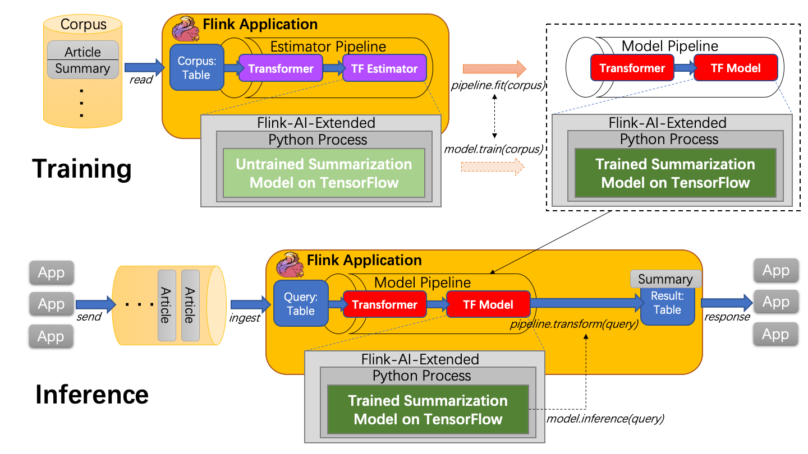

## 2019 Summer Intern Mission

### Goal:

Build an end-to-end application for abstractive document summarization on top of TensorFlow, Flink-AI-Extended [1] and Flink ML pipeline framework [2].

### Introduction

Document summarization is the process of shortening a text document in order to create a summary with the major points of the original document.

In general, a native Flink application will be built to serve an external document summarization application. In the training phase, a corpus with plenty of article-summary tuple will be fed as input to an estimator pipeline for training to produce a model pipeline. In the reference phase, the Flink application will use the trained model pipeline to serve the summarization request from external application, which take raw article as input and response the summary.

Inside the estimator pipeline, an abstract TF estimator will be created on top of Flink ML pipeline framework. The TF estimator is actually an untrained tensorflow model running in python, which use Flink-AI-Extended to connect to tensorflow. After fitting the corpus(or training), the estimator pipeline will be converted to a model pipeline. Similarly, a abstract TF Model will be created inside the model pipeline, which actually use trained model on tensorflow to execute transform function.

The design of the entire system is shown below:



### Schedule (JUL 1st - AUG 2nd)

​	**Week1**: Build an abstractive document summarization application on top of pure TensorFlow. Implements the ability to train models from the original corpus and generate summaries for new articles.

​	**Week2**: Encapsulate and call model’s training & inference function through Flink-AI-Extended

​	**Week3**: Integrate into the ML pipeline framework and train/inference/persist the model through pipeline

​	**Week4**: Build a simple WebUI, summarize & demo, make suggestions and improvements

​	**Week5**: buffer period

### Expected contributions

1. Build a complete application, connect TensorFlow <—> Flink-AI-Extended <—> Flink ML pipeline framework. Lessons learned from the perspective of MLlib users and developers.
2. Found the disadvantages of Flink-AI-Extended and ML pipeline in use, design and implementation
3. Suggestions and practical improvements for the disadvantages

### References

\[1] [Flink-AI-Extended: Extend deep learning framework on the Flink project](https://github.com/alibaba/flink-ai-extended)

\[2] [Flink ML pipeline framework: A new set of ML core interface on top of Flink TableAPI](https://github.com/apache/flink/tree/release-1.9/flink-ml-parent)


## Usage

### 1. Clone this project

```bash
git clone git@github.com:LittleBBBo/TextSummarization-On-Flink.git
```

### 2. Download processed data & pretrained model

```bash
# Change dir form project root
cd data/cnn-dailymail
# This step will download 'finished_files.zip' from Google Drive,
# then unzip to 'data/cnn-dailymail/finished_files',
# finally remove 'finished_files.zip'
bash download_data.sh

# Change dir form project root
cd log
# This step will download 'pretrained_model_tf1.2.1.zip' from Google Drive,
# then unzip to 'log/pretrained_model_tf1.2.1',
# finally remove 'pretrained_model_tf1.2.1.zip'
bash download_model.sh
```

### 3. Setup

#### 3.1 Install required environment

Python  2.7

Java 1.8

cmake >= 3.6

Maven >= 3.3.0

#### 3.2 Build Flink-AI-Extended from source

Follow the README from https://github.com/alibaba/flink-ai-extended

**Compiling commands will automatically install tensorflow 1.11.0**

```bash
git clone git@github.com:alibaba/flink-ai-extended.git
mvn -DskipTests=true clean install
```

#### 3.3 Build Flink 1.9-SNASHOT from source

Follow the README from https://github.com/apache/flink/tree/release-1.9:

```bash
git clone git@github.com:apache/flink.git
# switch to release-1.9 brach
mvn -DskipTests=true clean install
```

#### 3.4 Install nltk package

```bash
pip install nltk

# To install 'punkt' tokenizers,
# run follows once in Python:
import nltk
nltk.download('punkt')
```

### 4. Run training or inference

Running examples in **TensorFlowTest.java**:

```java
public class TensorFlowTest {
    public static final Logger LOG = LoggerFactory.getLogger(TensorFlowTest.class);
    private static final String projectDir = System.getProperty("user.dir");
    public static final String[] scripts = {
            projectDir + "/src/main/python/pointer-generator/run_summarization.py",
            projectDir + "/src/main/python/pointer-generator/__init__.py",
            projectDir + "/src/main/python/pointer-generator/attention_decoder.py",
            projectDir + "/src/main/python/pointer-generator/batcher.py",
            projectDir + "/src/main/python/pointer-generator/beam_search.py",
            projectDir + "/src/main/python/pointer-generator/data.py",
            projectDir + "/src/main/python/pointer-generator/decode.py",
            projectDir + "/src/main/python/pointer-generator/inspect_checkpoint.py",
            projectDir + "/src/main/python/pointer-generator/model.py",
            projectDir + "/src/main/python/pointer-generator/util.py",
            projectDir + "/src/main/python/pointer-generator/flink_writer.py",
            projectDir + "/src/main/python/pointer-generator/train.py",
    };
    private static final String hyperparameter_key = "TF_Hyperparameter";
    public static final String[] inference_hyperparameter = {
            "run_summarization.py", // first param is uesless but placeholder
            "--mode=decode",
            "--data_path=" + projectDir + "/data/cnn-dailymail/cnn_stories_test/0*",
            "--vocab_path=" + projectDir + "/data/cnn-dailymail/finished_files/vocab",
            "--log_root=" + projectDir + "/log",
            "--exp_name=pretrained_model_tf1.2.1",
            "--batch_size=4", // default to 16
            "--max_enc_steps=400",
            "--max_dec_steps=100",
            "--coverage=1",
            "--single_pass=1",
            "--inference=1",
    };
    public static final String[] train_hyperparameter = {
            "run_summarization.py", // first param is uesless but placeholder
            "--mode=train",
            "--data_path=" + projectDir + "/data/cnn-dailymail/finished_files/chunked/train_*",
            "--vocab_path=" + projectDir + "/data/cnn-dailymail/finished_files/vocab",
            "--log_root=" + projectDir + "/log",
            "--exp_name=pretrained_model_tf1.2.1",
            "--batch_size=4", // default to 16
            "--max_enc_steps=400",
            "--max_dec_steps=100",
            "--coverage=1",
            "--num_steps=10", // if 0, never stop
    };

    @Test
    public void testModelInference() throws Exception {
        TestingServer server = new TestingServer(2181, true);
        StreamExecutionEnvironment streamEnv = StreamExecutionEnvironment.getExecutionEnvironment();
        StreamTableEnvironment tableEnv = StreamTableEnvironment.create(streamEnv);
        Table input = tableEnv.fromDataStream(streamEnv.fromCollection(createArticleData()),
                "uuid,article,summary,reference");

        TFModel model = createModel();
        Table output = model.transform(tableEnv, input);

        tableEnv.toAppendStream(output, Row.class).print().setParallelism(1);
        streamEnv.execute();
        server.stop();
    }

    @Test
    public void testModelTraining() throws Exception {
        TestingServer server = new TestingServer(2181, true);
        StreamExecutionEnvironment streamEnv = StreamExecutionEnvironment.getExecutionEnvironment();

        StreamTableEnvironment tableEnv = StreamTableEnvironment.create(streamEnv);
        Table input = tableEnv.fromDataStream(streamEnv.fromCollection(createArticleData()),
                "uuid,article,summary,reference");
        TFEstimator estimator = createEstimator();
        estimator.fit(tableEnv, input);
        streamEnv.execute();
        server.stop();
    }

    private List<Row> createArticleData() {
        List<Row> rows = new ArrayList<>();
        for (int i = 0; i < 8; i++) {
            Row row = new Row(4);
            row.setField(0, String.format("uuid-%d", i));
            row.setField(1, String.format("article %d.", i));
            row.setField(2, "");
            row.setField(3, String.format("reference %d.", i));
            rows.add(row);
        }
        return rows;
    }

    public static TFModel createModel() {
        return new TFModel()
                .setZookeeperConnStr("127.0.0.1:2181")
                .setWorkerNum(1)
                .setPsNum(0)

                .setInferenceScripts(scripts)
                .setInferenceMapFunc("main_on_flink")
                .setInferenceHyperParamsKey(hyperparameter_key)
                .setInferenceHyperParams(inference_hyperparameter)
                .setInferenceEnvPath(null)

                .setInferenceSelectedCols(new String[]{ "uuid", "article", "reference" })
                .setInferenceOutputCols(new String[]{ "uuid", "article", "summary", "reference" })
                .setInferenceOutputTypes(new DataTypes[] {DataTypes.STRING, DataTypes.STRING, DataTypes.STRING, DataTypes.STRING});
    }

    public static TFEstimator createEstimator() {
        return new TFEstimator()
                .setZookeeperConnStr("127.0.0.1:2181")
                .setWorkerNum(1)
                .setPsNum(0)

                .setTrainScripts(scripts)
                .setTrainMapFunc("main_on_flink")
                .setTrainHyperParamsKey(hyperparameter_key)
                .setTrainHyperParams(train_hyperparameter)
                .setTrainEnvPath(null)

                .setTrainSelectedCols(new String[]{ "uuid", "article", "reference" })
                .setTrainOutputCols(new String[]{ "uuid"})
                .setTrainOutputTypes(new DataTypes[]{ DataTypes.STRING })

                .setInferenceScripts(scripts)
                .setInferenceMapFunc("main_on_flink")
                .setInferenceHyperParamsKey(hyperparameter_key)
                .setInferenceHyperParams(inference_hyperparameter)
                .setInferenceEnvPath(null)

                .setInferenceSelectedCols(new String[]{ "uuid", "article", "reference" })
                .setInferenceOutputCols(new String[]{ "uuid", "article", "summary", "reference" })
                .setInferenceOutputTypes(new DataTypes[] {DataTypes.STRING, DataTypes.STRING, DataTypes.STRING, DataTypes.STRING});
    }
}
```

